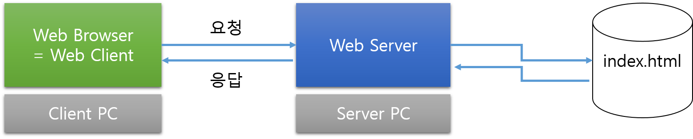

# day 1
---
2016-08-06 10:00 부산대
[생활코딩 질문지](https://goo.gl/mXLPWH)

# 질문하기!
- 프로젝트 중 부딪친 어려움
  - 완성된 프로젝트를 보고 내 프로젝트에 필요한 부분만 가져와서 작업하는 식
    - 하지만 제대로 이해하고 코드를 가져오게 된게 아닌 것 같다. 아마 복잡도를 무시했던!! 복잡도에 혀를 내두름
  - API 사용하고, 오픈 소스 사용해서 개발 비용과 시간을 줄여라.
    - 

# 생각
- 항상 첫 각오를 하고 오는 것이 중요한 듯... 뭔가를 임하기 전 다짐이나 슬로건 같은 것
  - 생각해보니 흔치않은 기회였는데 돌이켜 생각해보니 후회된다.

## 웹
웹앱=홈페이지=웹사이트=웹애플리케이션

*프로그래밍은 "실용적인 사례"가 있어야 제대로 이해가능하다.*
"이론 공부 후 실제 적용된 사례나 코드를 보기"

**다양한 기술들**
여러 기술이 복합될때 이해를 잘 못해
20년동안 기술 발전. 아주 복잡해졌다.

**낮은 진입 장벽**

## 인터넷
서버-클라이언트의 개념을 잘 몰라서 웹 프로그래밍이 어려운 경우가 있다.

*원리를 알자*

##### 무엇을 모르는지 모르는 상태 -> 무엇을 모르는지 아는 상태
자기가 무엇이 부족한지 스스로 파악해야한다. 무엇이 약하고 필요한지 알게되면 전체학습이 아니라 **부분학습**이 가능하다. 시간절약이 된다. 공부 전략을 스스로 세워라! 공부에 활력과 생기가 생긴다.

##### 시작이 반이다
알면 알수록 높아지는 산 <- 기초 개념과 기본 원리 부족

1. 구상을 해보시오
도구를 쓰는 방법을 배웠으니, 이 도구로 무엇을 하고 싶은가?
2. 기획-계획
구상을 구체적으로 하는 단계. 어떻게 동작해야하는지 구체적으로 계획하는 단계
3. 디자인/개발
UI 

##### 페트병
마사지도구, 콩병, 모기약
제품의 초기의도도 중요하지만 소비자에게 갔을때 어떤 창의력을 발휘하게 하는지...
그러나 보온병은 그 용도외에 딱히 잘 쓰이지 않는다.
"세세한 부분에서 큰 것을 보는 능력" "일상에 얼마나 관심을 가지고 있는지 보인다."

##### start small
처음부터 너무 많은 기능을 기획해버리면 딱 그용도로밖에 못쓴다.

리눅스, 윈도우등은 커다란 빌딩만큼 거대하다.
sw를 변경하기 쉬운 것 맞으나
복잡도가 너무 크게 증가하므로
인간의 사고과정을 넘어가버리기 때문에 수정하고 쓰기 어려울 수 있다.

##### 복잡도 문제에 관심가져라
기능을 하나 만들때 신성하게 생각하라
그 기능 하나가 복잡도를 어마어마하게 높일 수 있는데,
자기가 복잡도를 무시하고 넘어가기 때문에 문제를 인지 못하고 그냥 그저 어려운것으로 취급하게된다.
그러면 프로젝트는 산으로...
복잡도 트라우마? 언젠간 생길걸
지수? 지수 폭발!!! 
개발이 위험한 것은 그 위험성이 잘 드러나지 않기 때문이다.
대놓고 어렵지 않고 왠지 어렵다...

##### 사실 start small이 고수다.
복잡도 속에서 허우적 거리고, 막장 경험해야 깨달을 걸.
인간의 본성이 start large.
계획만 방대하게 세우고~

##### 웹
서버라는 산이 거대해보이지만 그리 어렵지 않다.
전체적인 맥락을 파악하는 것이 중요하다.
막연하고 그저 마법같은 것에 구체성을 가지고 보자.
개발 영역을 나눴더니 클라이언트 개발은 DB에 관심없고 

##### 남을 만족시키는 sw개발

##### 소통이 굉장히 중요하다
우린 말하지 않아도 알아요 <- 가장 위험한 단계
말의 힘을 과신하지 마라, 말은 항상 문제점을 발생시킨다.
현업 설명후 다시 그 설명을 시켜보도록 하기. 내가 얘기한 것과 일치하면 커뮤티케이션 실패확률 law. 일방적으로 말하고 나서 그냥끝내지 마라.
프로젝트할때 사용자 입장에서 그림을 그려보는 것은 아주 좋다.

* UI 스케치 앱 추천
  * pencil.evolus.vn
  * balsamiq 유료 

## 웹의 역사
##### Q. 인터넷과 웹은 다를까?
다르겠지..?
A. 인터넷이 도로면 웹은 그 도로를 달리는 자동차
인터넷이 OS라면 웹은 소프트웨어
웹⊂인터넷
{웹, FTP, email}⊂인터넷

##### 인터넷 탄생 60', 웹의 탄생 90'
인터넷은 군사시설, 연구시설에서만 사용되는 엘리트 도구
인터넷은 군사시설에서 시작된 프로젝트?
중앙집중식(전화국) - 한계
분산형 - 분산된 형태로 통신을 하는 것 -> 인터넷

##### Q. 웹이 최초로 탄생한 국가는?
미국?
A. 스위스이다. 스위스에서 웹이 출현했다.
스위스 CERN(유럽입자물리연구소)이라는 큰 연구소가 있다.
그 연구소에는 LHC(강입자 가속기)가 있다. 둘레의 길이가 27km에 달한다. 전자석으로 이뤄져있고, 그 입자(소립자)가 전자속으로 인해 가속시켜 서로 충돌시켜 어떤일이 일어나는지 연구한다.
HDD 테라의 벽을 넘은 것이 CERN의 공
CERN은 1980년대 정보 홍수속에서 살았다.
팀 버너스-리가 CERN에 취직을 하게 된다. 계산기에 불과했던 컴퓨터 연구
**Enquire** 무엇이든 물어보세요. 팀이 10년동안 깨알같이 enquire를 개발했다. 그리고 1990.10 웹페이지 편기를 만들었다.
세계최초의 웹브라우저 이름이 world wide web
세계최초의 웹 사이트 : info.cern.ch, 인류 문명의 발상지
60년대부터 천천히 발전하던 인터넷이 90년에 웹을 만나면서 웹 발전이 폭발적으로 발전했다. 그러면서 대중화되었다.

##### 그냥 필요한것만 빠르게 배워가면 지식에 대한 소비자일 뿐이다.
소비는 할 수 있으나 자기것으로 만들기 힘들다.
'팀버너스리가 웹을 만들었다'라는 그냥 사실만 알면 팀 버너스리는 그저 천재일뿐.
그러므로
그 역사와 의도와 근간과 맥락을 알고 있어야 우리도 할 수 있다.

##### 처음 웹이 등장했을 때 그 상태를 알자
웹 브라우저 
서로 통신할 때 사용하는 규약 HTTP
주소로 접속하는 URL
모두 팀이 만들었다.
팀 버너스리가 대단한게 아니라 그 시대가 대단하다.

오늘날의 웹은 너무나 복잡하다.
한눈에 들어오지 않는다.
높은 해상도로 공부하자!!!
아주 복잡해보이나 초기에는 아주 단순하다.

웹 퍼블리셔 html css js까지만 알면된다. 그러나 직업은 고정적이지 않다. 세상은 복잡해지는데, 복잡성은 생산성을 추격한다. 분업화하던 일들이 분업화가 필요없
어느 한시대에나 적합한 직군일뿐. 직업적인 구분이 상당히 많이 달라질 수 있다.
포괄적으로 여러가지를 알면 더 좋다.

broken english
정보 홍수의 막장

파이선, 루비는 미국에서 나온게 아님

## 간단한 사이트 만들기

##### bitnami
이를 설치하면  3개의 프로그램이 깔린다. **aphache 웹서버**와 **PHP 미들웨어**와 **MySQL 데이터베이스**가 설치된다. APM을 한번에 설치하는 것이 bitnami이다.
왜 bitnami인가?


##### apache 
웹 서버의 왕좌의 자리. free, open source
클라이언트는 소비자의 세계. 친절하고 단순하다. 서버는 생산자의 세계. 친절하지도 않고 단순하지 않다.

##### 서버와 클라이언트
웹브라우저가 설치된 컴퓨터는 클라이언트
모르는 건 마법 아는 건 기술
서버의 웹서버(프로그램)이 index.html을 찾아와 응답한다.
웹 서버는 요청에 대해 데이터를 찾고 응답해주는 프로그램이다.
웹 서버 제품으로는 아래와 같은 것들이 있다.
- Apache (http web server)
- IIS
- nginx 


추상적인 것 너무나 힘들어
구체적인 것 내놔

##### VPN

컴퓨터는 추상적이라 힘들다.
이론들으면 안개속을 헤메는 느낌.

##### html 은 약속
```
<b>라는 태그를 만나면 bold체로 표시하기로 한 약속이다. </b>를 만날때까지
```

## note
- ms 네트워크 강의 ==> facebook
- 픽토그램등을 모아둔 사이트. ppt이미지 유용. https://thenounproject.com/
- deezer.com 노래
- 남에게 무언가를 알려줄때, 설명하고 다시 설명하라 해보기
  - 설명이 길어지면 핵심만 요약해서 다시 브리핑하기
  - 내가 잘 이해했는지 말할테니까 다시 들어달라고 하기
- 아파치 서버 접근 로그 시각화 프로그램
  - http://logstalgia.io/ 재밌네
  - http://gource.io/
- 꿀 사이트
  - pngimg.com
  - pixabay.com
- 크롬 웹 스토어 (크롬 확장도구)
  - adguard 타의 추종을 불허하는 광고차단 앱!
    - 앱스토어라곤 구글플레이밖에 몰랐지...
  - 확장도구 앱 개발해서 올려보는 것도 좋을 듯
    - 브라우저 확장 도구
    - 에디터 확장 도구
    - 또한 남의 오픈소스 프로젝트를 수정해서 contributor가 되어 보는 것도 좋을 것이다.