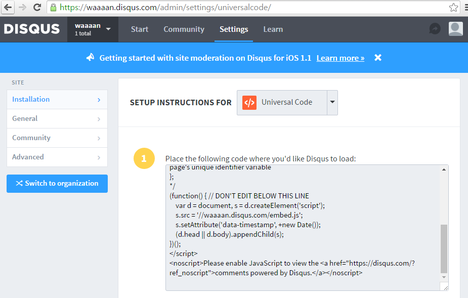
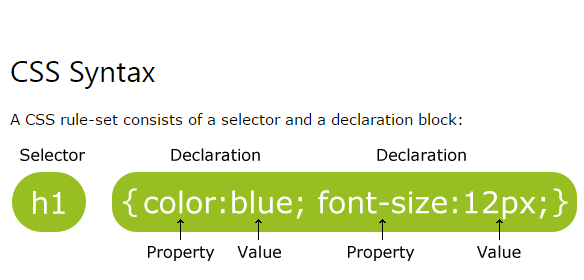

# 수업 2일차

---

## DISQUS
댓글 기능을 가져와서 내 사이트에 추가해보자.

DISQUS : http://disqus.com
- 회원가입하고 site를 만든다
- 만든 site에서 settings 탭을 누르고 univesal code를 누른다.
- 1번 코드를 복사하고 적용할 html에 붙여넣기한다.


## UserLike
- 회원가입을하고 가이드에 나오는 코드를 적용할 html페이지 </body>위에 붙여 넣는다.
```
 <script type="text/javascript" src="//userlike-cdn-widgets.s3-eu-west-1.amazonaws.com/7718d927ca342ba3a38bc29179506b34498bd2f2942176763f057cb33f9e19f7.js"></script> 
```
- 우측 하단에 채팅창이 생기고, 사이트 관리자에게 실시간으로 문의할 수 있다. 
- 사이트 관리자는 userlike 홈페이지 내에서 즉답할 수 있다. 

***// API 라이브러리 플러그인 서드파티 위젯***

## CSS


####selector

**선택자 우선순위는 구체적일 수록 높고 포괄적일 수록 낮다.**

- id selector : 요소의 식별자 역할을 하므로, 문서에서 단 한번만 등장한다. (학교에서 학번)
- class selector : (학교에서 반)
- tag selector : 포괄적이고 정교하지 않은 선택자. 모든 태그를 선택한다.

***// 프로그래밍 코드는 표현력이 짱! 복잡해보이는 일을 이렇게 간결하게 표현하다니!***

#### HTML tag는 각각 스타일 기본값을 가지고 있다.

각 태그들마다 스타일 기본값을 가지고 있다. display 프로퍼티에 inline 또는 block으로 값을 지정하여 기본값을 다르게 설정할 수 있다.

- block level elements(tag)
  - 블럭 레벨 태그
  - `<a>`, `<strong>`, `<div>` 등
- inline level elements(tag)
  - 인라인 레벨 태그
  - `<h1>`, `<li>` 등

## Atom
#### 웹 프로그래밍 언어의 탈 웹 화
예전에 웹을 주로 작성하던 언어들은 최근 웹을 벗어나 적용 범위가 확장되어 가고 있다. atom 에디터도 html, css, javascript로 만들어졌다. 

크롬 개발자 도구 chromium이라는 플랫폼위에서 크롬 브라우저가 만들어졌고, 그 위에서 atom이 만들어졌다. github 회사가 만들었다. atom menu > view > developer > toggle developer tools를 누르면 크롬개발자도구를 볼 수 있다(단축키 ctrl + alt + i).

#### 확장도구
- 코드라인 정렬 - atom beautify

## PHP
#### URL 비교
```
http://localhost/1.html
http://localhost/2.html
http://localhost/3.html
```
```
http://www.clien.net/cs2/bbs/board.php?bo_table=use&wr_id=919870
http://www.clien.net/cs2/bbs/board.php?bo_table=useful&wr_id=253085
http://www.clien.net/cs2/bbs/board.php?bo_table=jirum&wr_id=578889
```
위는 각 페이지를 표하는 만큼의 html파일을 가지고 있다.

아래는 하나의 php파일로 여러개의 html을 표현하고 있다. board.php가 id 값에 해당되는 페이지를 만들어준다.

#### php.ini

php 설정파일 수정하자

**opcache_enable = 1 -> 0**
- OPcache를 사용하지 않기 위해서이다.
  - OPcache란 PHP 7.0에 내장된 새로운 캐시엔진이다.
  - PHP script 를 bytecode로 컴파일한 후에 공유 메모리에 저장하여 성능을 향상시키는 모듈이다.
  - DOM 캐싱: JS에서 요소를 캐싱해 놓으면 DOM조작이 더 빨라진다.
  - 참고 : http://blog.alyac.co.kr/619, NHN은 이렇게 한다

**display_errors = Off -> On**
- 에러 출력

apache를 껐다 켜자(restart). 아파치에 php가 실행되고 있으므로, 변경한 php.ini(PHP 환경설정 파일)이 반영되도록 하자.

#### PHP 동작 방식

**`1.html`과 `1.php`의 비교**
두 파일에 동일한 php 코드가 존재하지만, 접속해보면 `1.html`에는 php코드가 그냥 표시되고, `1.php`는 php코드가 실행된 결과가 나온다.

**PHP 동작 방식**
1. 웹 브라우저가 `.php`파일을 요청한다.
2. 웹 서버가 웹 브라우저의 요청에서 확장자를 확인하고, `.php`파일이라면 php 프로그램에 작업을 넘긴다.
3. php 프로그램이 `.php`파일을 디스크에서 찾아와 읽기 시작하고, php 코드를 만나면 그 코드를 실행한 뒤 그 코드를 지우고 코드 실행 결과만 남긴다.
4. php 프로그램이 코드 실행 결과를 웹 서버에게 전송한다.
5. 웹 서버는 그 결과를 웹 브라우저에게 전송한다.

#### 예제에 php 적용하기

## UI, API

#### interface, 접점
- User Interface: 사용자가 조작하는 접점
- Application Programming Interface: 앱을 프로그래밍하는 접점

> 컴퓨터는 인류가 함께 만든 거대한 시스템이다. 특정인 혼자 이뤄낸게 아니다.

> 이 세상 그냥 되는 것 없다. 절대 당연한 것 없다.

#### 이들은 어디에서 왔나? where are they from?
level | system
-----|-----
high | UI
 | 웹 애플리케이션
 | 웹 브라우저
 | 운영체제
 | C
 | 어셈블리어
 | 기계어
 | 전자공학
 | 전기공학
 low | 물리학

> 당신이 하고자 하는 일에 적합한 언어가 있다.

#### API
disqus와 userlike가 제공한 것은 js, php, html 등에 결합해서 무언가를 창조해냈다. 결합의 대상이 되는 부품을 API라고 한다. 현재는 API가 참 중요한 시대라고 생각한다.

운영체제가 출현하고, 운영체제들이 기본 API를 제공했다. 그 운영체제에서 실행되는 애플리케이션들은 운영체제가 제공하는 API들을 결합해서 만들어졌다. 이렇게 운영체제는 많은 소프트웨어를 만들어냈다.

시간이 지나고 **돌연변이**들이 나타났다. API를 제공하는 애플리케이션이 나타나기 시작했다. 대표적으로 웹 브라우저가 그것이다. 이렇게 웹이 상승세를 타기 시작하고 닷컴 기업들이 출연했다(야후 등).

또 닷컴에서 돌연변이가 나타났다. 웹 애플리케이션이 API를 제공하기 시작한 것이다(트위터, 페북, 구글). 그렇게 그 API를 사용한 앱들이 만들어졌다.

그리고 잡스가 아이폰을 들고 나왔을때, 그것은 새로운 API가 대거 나타났다는 뜻이었고, 모바일 IT산업은 대 호황을 맞았다.

> 새 API가 출현할때마다 IT가 호황을 맞는다

이제 사물까지 프로그래밍적으로 조작이 가능하다. 인터넷을 통해 전구에 신호를 보내

####지금 이 시대
**API의 폭발적 증가** + **쉬워진 프로그래밍**

이제 사물까지 프로그래밍적으로 조작이 가능하다. 사물조차 API를 가지는 것이다. 즉, 우리가 제어할 부품이 늘어나고 있고, 이들을 조합해서 무언가를 만들어낼 수 있는 방법이 쉬워지고 있다(아두이노).

> 프로그래밍이 쉬워지고 있다. 

현재 알람 맞추라는 명령만 내리는 시리에게 언젠가는 이런 명령을 내리게 될 것이다. 
```
내 전화번호부 중 고등학교 동창들을 선택해서 매년 크리스마스 이브날에 기프티콘을 전송해줘.
```
사람들은 이제 컴퓨터로 쉬운것을 한다. 컴퓨터는 한 연구소의 도구가 아니라 모두의 영역이다.

> 우리가 컴퓨터 프로그래밍 하는 이유는 무엇인가?

본질적으로 기계를 제어하기 위함이다. 잊지말자. 원래 이유를 잊어버리면 추상적이고 뜬구릉 얘기가 되고, 점차 멀어지게 된다.

## 어떻게 프로그래밍 공부를 할까

> 정답은 없다. 상황과 성향에 따라 모두 다르다.

- 적정 용도의 언어를 적정 수준으로 배워라.
- 자기가 무엇을 할 것인지 정하고, 그 구체적 방법을 배워라.
- 무엇을 할 것인지 모르겠으면 아무거나 일단 시작해보라.

*// 언어는 단어를 많이 알수록, (책을 많이 읽을수록, 글을 많이 쓸수록) 표현력이 풍부해진다. *

*// 관계대명사 이런거 안쓰면 왠지 내 문장 초라해 보여... 그러면 글도 안써지고 실력도 늘지 않겠지.*

- 프로그래밍의 가장 보편적이고 기본적인 규칙
  1. 변수
  2. 비교
  3. 조건
  4. 반복
  5. 함수

#### Keep try! 
**많은 사람들이 기초가 중요한 건 알지만, 기초만으로도 많은 것을 할 수 있다는 건 잘 잊는 것 같다.** 계속 시도하고 노력해야 한다. 어린이 단계가 있으니 어른이 된 것이다. 기본적인 규칙들을 조립해서 어떤 제품을 만들어 보라. 너무 많이 공부해버리면 무엇부터 해야할지 모르게된다. 객체지향, 디자인 패턴은 코드가 방대해질 경우에나 필요하다.

*// 많이 공부했더니 좋은 코드가 어떤것인지는 안다 -> 스스로 프로그래밍한 코드를 보기 싫어진다 -> 코딩이 재미없어진다. 그러면 생산자가 아니라 비평가가 될 수 밖에 *

#### API를 탐험하자
API를 많이 알수록 많은 일을 할 수 있는 가능성을 가진 사람이다. **API를 탐험하는 것은 세계를 여행하며 견문을 넓히는 것과 같다.**

#### 좋아할 관객을 찾자
관객 만족시키기 위해 여러가지 노력하게된다. 더 좋은 감동을 주기위해 더 공부하고 즐겁게 공부하게 된다.

## impressive
> 기초와 기본만으로도 많은 것을 할 수 있다.

거대 목표만 보고 달려가면 근본적인 것을 배우기 위한 징검다리와, 기초적인 것 자체가 쓸모있는 것임을 잊어버리기 쉽다.

> 팀 버너스리가 컴퓨터가 없는 시대에 태어났다면 평범했을까?

그 누구도 평범하지 않다. 누구나 최고가 될순 없지만 누구나 고유하다.

> 선택

처음에는 기능이 작아 신경써야할 것들이 많아보이지 않겠지만, 기능이 많아지면 케어해야할 것들이 많아진다. 완성도를 100%까지 가는 일은 굉장히 많은 노력을 요구하는 일이다. 90% 완성도까지 갈 것이냐 100%까지 갈 것이냐는 선택의 문제이다. 높은 완성도까지 가는 것은 굉장히 힘든 일이다. 애플처럼 전세계사람들이 사용할 것이면 결코 완성도에 있어서 타협하지 않아야한다. 그러나 혼자 쓰기 위한 제품이거나, 사용자 범위가 좁다면, 완성도를 적당한 선에서 타협하는 것이 훨씬 현명하다.

> 프로그래밍하는 것은 어학연수 온 것과 비슷하다.

읽어야만 해결할 수 있는 것들이 많다. 현재는 한글로 된 자료가 충분할지 몰라도, 언젠가는 한글로 된 자료에 한계를 느낄 것이다. 느껴야한다. 느끼지 않으면 열심히 하지 않은 것이다. 느리더라도 영어를 읽자. 실력으로 꾸준히 축적될 것이다. 

*// 영어랑 씨름을 해버리면 빨리 지칠수 있지만... 장기전에 대비하라.*

> 프로그램을 만드는 것도 표현이다.

표현하는 욕구, 표현하는 욕망는 인간의 본능이다. 그 표현 방법이 다를 뿐이다.

> 이론보다 먼저 한계를 경험하라.

경험부터 먼저하고 알고리즘..자료구조...프레임웤.. 차근차근 가라. 365일 치 식사를 하루만에 소화할 수 없다. 알고리즘이 매우 중요하나 **경험이 우선이다.** 알고리즘 없이 먼저 개발해보고 한계를 먼저 경험한 뒤에 알고리즘을 배우고 적용해보라.

*// 선배들이 후배들에게 빨리 배웠음 하는 마음이...그래서 후딱 이론 가르치니 부작용도 있어*

> 당신이 하고자 하는 그 일을 지원한다면 그 솔루션을 쓰는게 맞다.

이고잉 @ 메일 

## 생각
난 이미 웹 개발에 대해 안다고 생각했는데 사실 아는 게 아는 것이 아니었다.

해오면서 불확신했던 부분에대해 확신을 주고 혼란스러웠던 부분에 

그리고 후회하거나 스스로 자책했던 부분에 대해 많은 위로가 되었다.

어떤 부분은 확신을 가지게 해주고 어떤 부분은 반성하게 되었다.

많은 부분을 심하게 공감했다.
정말정말 성의있게 강의했다. 여러부분에서 충족된 마음을 가지고 돌아가게되었다. 양손무겁게 배우고 얻어간것 많아

쉽게 쉽게 설명하기 위해 얼마나 많이 연구하고 관찰했을지가 느껴짐 동영상강의때도 알았지만 진짜 동영상에서는 느낄수 없는 감동을 배우고 감
정답이 없음에도 많은 대안들을 제시해주려고 노력
본인의 경험을 뭐랄까 진심있게? 진심어린? 충고와 솔직하게 터놓고

더 나은 것을 위해 많이 탐구하고 연구하고
얼마나 많이 애썼을지 느껴진다. 정성이 느껴짐 그냥 대충이나 추측이나 불확신성이나 얼렁뚱땅이라는 게 느껴지지 않음.

## ID/PW
- disqus.com
  - facebook/ame@nav/eh234
- uploadcare.com
  - github로 로그인 /ju@da/d4
- userlike.com
  - facebook 로그인

## 질문
aaa라는 개인 블로그 개설 시

티스토리
aaa.tistory.com

네이버블로그
naver.com/aaa

두 방식은 어떤 차이가 있는지?
어떤 기술이 사용되는지
직접 구현해보려고 했는데